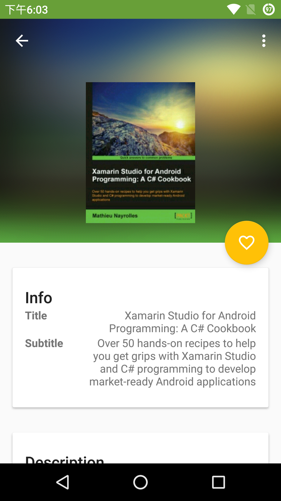

# Description

An unofficial android client to search most of IT ebooks from http://it-ebooks.info/

# Screenshot
<p>



</p>

<p>


</p>


# Thanks

[glide](https://github.com/bumptech/glide)
[okhttp](https://github.com/square/okhttp)
[smoothprogressbar](https://github.com/castorflex/SmoothProgressBar)
[materialsearchview](https://github.com/MiguelCatalan/MaterialSearchView)

# License

```
Copyright 2016 Ice.D.cap

	Licensed under the Apache License, Version 2.0 (the "License");
	you may not use this file except in compliance with the License.
	You may obtain a copy of the License at

		http://www.apache.org/licenses/LICENSE-2.0

	Unless required by applicable law or agreed to in writing, software
	distributed under the License is distributed on an "AS IS" BASIS,
	WITHOUT WARRANTIES OR CONDITIONS OF ANY KIND, either express or implied.
	See the License for the specific language governing permissions and
	limitations under the License.
```